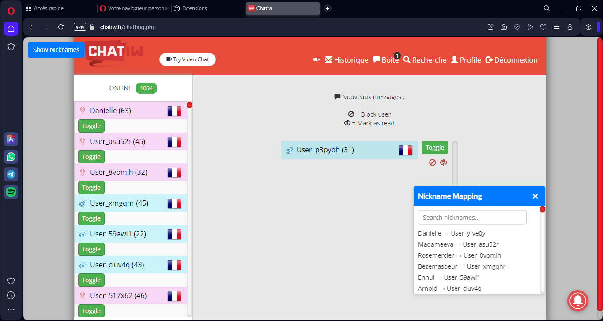

les instructions d'installation sur Opera GX :
# HiddenNickname

Si vous avez des propositions de mise à jour, n'hésitez pas à me contacter sur Discord : actheglitch
# Mise à jour du 14/01/2025

Ajout de la prise en charge Opera GX

# Mise à jour du 12/01/2025

Amélioration graphique générale de l'addon pour mieux s'accorder au site.

Ajout d'un pop-up pour afficher la liste des pseudos.

Ajout de la possibilité de chercher un pseudo dynamiquement dans la pop-up de liste de pseudos.

# Description

Replace Nicknames est une extension pour Opera GX qui remplace les surnoms des utilisateurs sur les sites chatiw.com et chatiw.fr par des mots aléatoires. Elle permet également de basculer entre le surnom original et le surnom généré aléatoirement grâce à un bouton dédié.

Vidéo démonstration : YouTube
Installation
Étape 1 : Télécharger le code .zip sur GitHub

    Téléchargez le fichier .zip contenant le code de l'extension.
    Extrayez le contenu du fichier .zip.

Étape 2 : Activer le mode développeur dans Opera GX

    Ouvrez Opera GX.
    Tapez opera://extensions dans la barre d'adresse et appuyez sur Entrée.
    Activez le mode développeur en cliquant sur le bouton en haut à droite de la page.

Étape 3 : Charger l’extension

    Cliquez sur le bouton "Charger l'extension non empaquetée" ou "Load unpacked".
    Dans la fenêtre de sélection de fichier, sélectionnez le dossier contenant le fichier manifest.json.
    L’extension sera maintenant activée temporairement dans Opera GX.

# Utilisation

    Naviguer sur les sites cibles

    Rendez-vous sur chatiw.com ou chatiw.fr.
    L'extension commencera automatiquement à remplacer les surnoms des utilisateurs visibles dans le chat.

    Basculer entre les surnoms

    Chaque surnom modifié est accompagné d'un bouton Toggle.
    Cliquez sur ce bouton pour basculer entre le surnom généré et le surnom original.

    Fonctionnement en arrière-plan

    L'extension surveille les nouveaux messages ou utilisateurs ajoutés et met à jour les surnoms automatiquement.

# Structure des fichiers

    manifest.json : Déclare les permissions et la configuration de l'extension.
    script.js : Code principal pour remplacer les surnoms et gérer les interactions.
    Styles intégrés : Appliqués dynamiquement pour styliser le bouton Toggle.

# Limitations

    L’extension fonctionne uniquement avec Opera GX en mode développeur (chargement temporaire).
    Pour une utilisation permanente, l’extension doit être signée par Opera.

# Contribution

    Forkez ce projet.
    Apportez vos modifications.
    Soumettez une pull request avec une description claire de vos changements.

Ce README devrait maintenant inclure toutes les informations nécessaires pour installer et utiliser votre extension sur Opera GX.